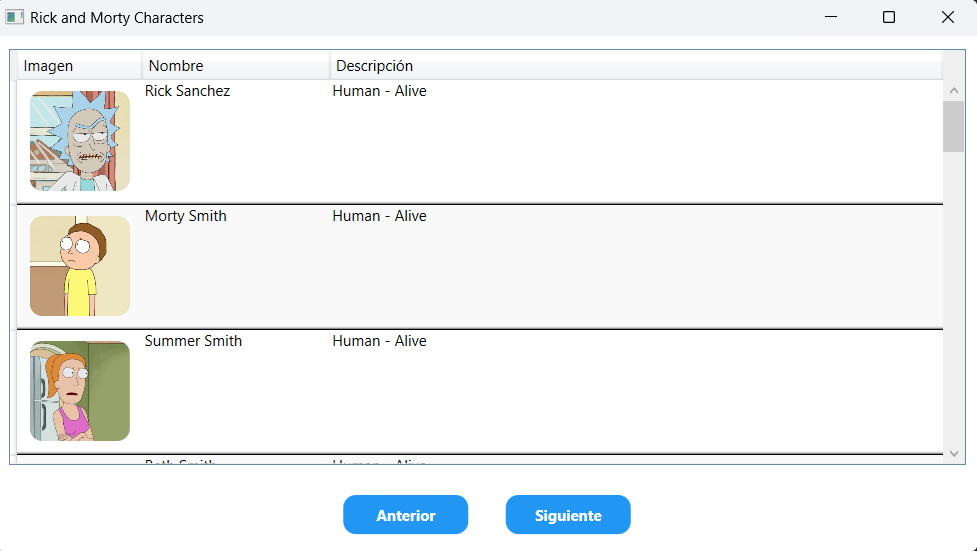
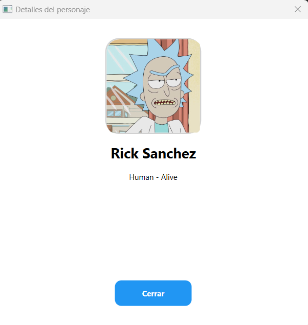

# 🧪 WpfApp_ejer4 - Rick and Morty Viewer

Una aplicación de escritorio desarrollada en **WPF (Windows Presentation Foundation)** que permite visualizar personajes de la serie *Rick and Morty* mediante el consumo de su **API pública**.

## 📌 Descripción General

### 🧾 Nombre
Rick and Morty Character Viewer

### 🎯 Objetivo
Visualizar información de personajes de la serie Rick and Morty, permitiendo la navegación paginada y visualización detallada de cada personaje.

### ⚙️ Tecnologías utilizadas
- **WPF** (Windows Presentation Foundation)
- **C#**
- **.NET 6**
- **API REST pública** [https://rickandmortyapi.com/](https://rickandmortyapi.com/)

---

## 🧱 Arquitectura y Diseño

### 🧩 Patrón de diseño
Se implementa una arquitectura basada en **MVVM simplificado**:
- **Modelo (`Models`)**: Representa los datos obtenidos desde la API.
- **Vista (`.xaml`)**: Define la interfaz gráfica.
- **Lógica de Vista (`.xaml.cs`)**: Contiene los eventos e interacción con la API.
- **Servicios (`Services`)**: Manejan la lógica de conexión y deserialización de datos desde la API REST.

### 📦 Componentes clave
- `RickMortyCharacter.cs`: Modelo principal del personaje.
- `RickMortyService.cs`: Servicio que se conecta a la API.
- `MainWindow.xaml`: Vista principal con paginación y `DataGrid`.
- `CharacterDetailWindow.xaml`: Ventana de detalles al seleccionar un personaje.
- `App.xaml`: Archivo de configuración y punto de entrada de la app.

### 🔌 Integración con la API
Se consume el endpoint:
```
GET https://rickandmortyapi.com/api/character?page={page}
```
El servicio usa `HttpClient` y deserializa la respuesta JSON a objetos `.NET`. Se manejan errores de red, control de páginas y carga de imágenes desde URL.

---

## ⚙️ Configuración y Uso

### 📋 Requisitos
- **Sistema Operativo:** Windows 10 u 11
- **Visual Studio 2022** o superior
- **.NET 6 SDK** (o versión compatible)
- **Conexión a internet** (para acceder a la API)

### 🛠️ Pasos para ejecutar

1. Clona el repositorio:
```bash
git clone https://github.com/Luixij/Rick-and-Morty-WPF-Viewer.git
```

2. Abre la solución `.sln` en Visual Studio.

3. Restaura los paquetes NuGet si es necesario:
```
Herramientas → Administrador de paquetes NuGet → Restaurar paquetes
```

4. Ejecuta el proyecto (F5 o Ctrl + F5).

---

## 🌐 API REST - Detalles Técnicos

### 🔑 Autenticación
No es necesaria. La API es pública y gratuita.

### 🔍 Endpoints utilizados
- `/api/character?page=n`: Devuelve una lista paginada de personajes.

### 🧠 Manejo de datos
- Se deserializa el JSON usando `System.Text.Json`.
- Se asigna directamente al `DataGrid` de la ventana principal.
- Al hacer clic en un personaje, se abre una ventana modal con sus detalles (nombre, estado, especie e imagen).

---

## 📸 Capturas

**Pantalla principal:**
> 

**Detalle de personaje:**
> 


---

## 🧑‍💻 Autor
Luis Imaicela  
Desarrollador y diseñador  
[https://luisimaicela.com](https://luisimaicela.com)

---

## 📄 Licencia
Este proyecto está bajo la licencia MIT.

